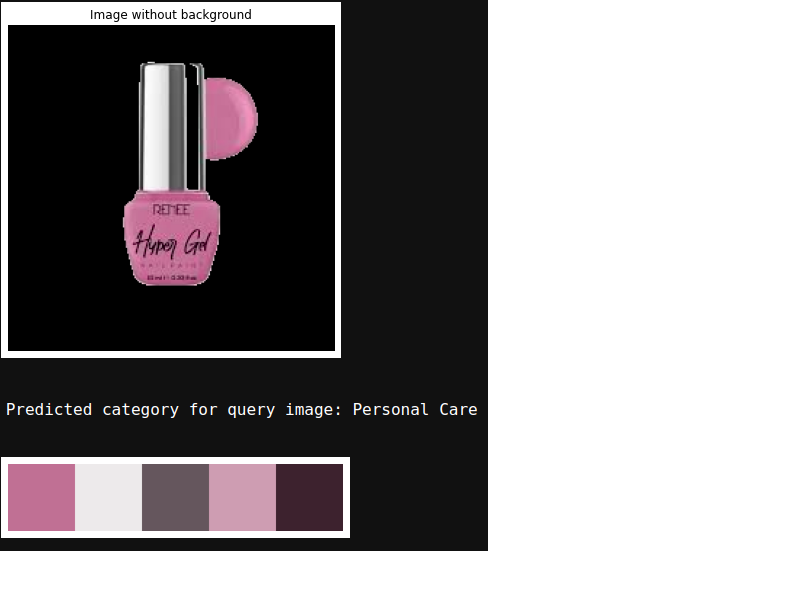
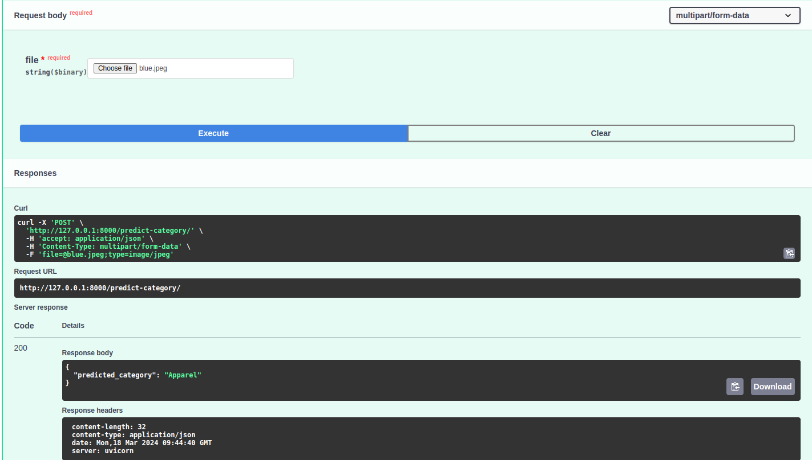

# Image masterCategory Classification Code & API
This project provides an API for image classification and color extraction. It utilizes a pre-trained model for categorizing fashion products and extracts dominant colors from images. The dataset used for training the model can be found at [Fashion Product Images (Small)](https://www.kaggle.com/datasets/paramaggarwal/fashion-product-images-small) on Kaggle. 




# Components
- Complete_Cat_Code.ipynb: Jupyter notebook containing the complete workflow of data processing, model training, and evaluation for category classification.
- File_Labels_Creation.ipynb: Jupyter notebook for creating and managing labels associated with the dataset.
- api_cat.py: Python script that provides the FastAPI implementation for serving the classification and color extraction functionalities.
- Category_Classification.ipynb: Jupyter notebook focusing on the category classification task, including model training and validation.

# Setup
Install the required Python packages:
```python
pip install fastapi uvicorn torch torchvision numpy pandas scikit-learn pillow opencv-python-headless
```

Download the trained model and label files, placing them in the appropriate directory as specified in the code.

Run the API using the command:
```python
uvicorn api_cat:app --host 0.0.0.0 --port 8000
```

# API Endpoints
- GET /: The root endpoint, which returns a welcome message.
- POST /predict-category/: Predicts the category of the uploaded image file.
- POST /extract-colors/: Extracts the dominant colors from the uploaded image file.
- 

  
# Usage
- For image classification, send a POST request to /predict-category/ with the image file.
- For color extraction, send a POST request to /extract-colors/ with the image file and the desired number of colors to extract.
- Data Processing and Model Training: Refer to Complete_Cat_Code.ipynb and Category_Classification.ipynb for details on data preprocessing, model training, and evaluation.
- File_Labels_Creation.ipynb is used for preparing the labels associated with the dataset for training.
  
# Note
Ensure that the file paths and configurations within the notebooks and API script are correctly set up to match your local or server environment.
